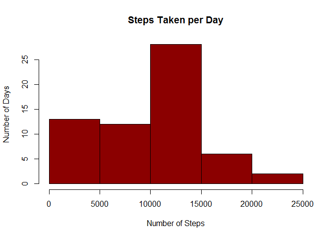
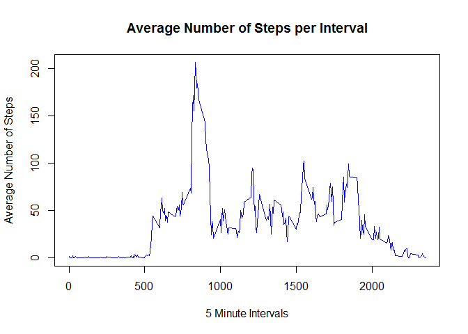
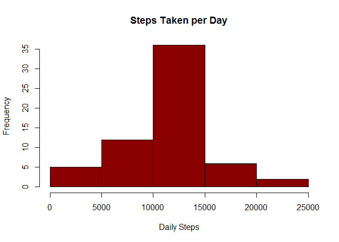
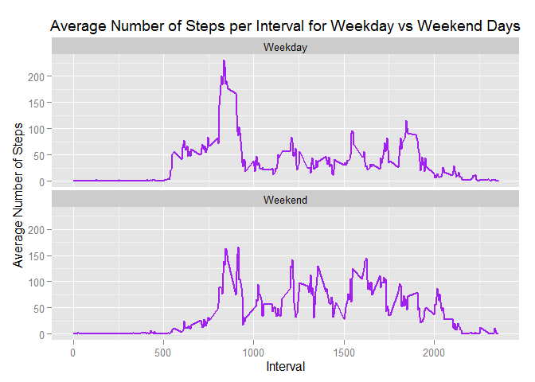

# Reproducible Research: Peer Assessment 1


## Loading and preprocessing the data
Load in the required packages:

```r
library(lubridate)
library(dplyr)
```

```
## 
## Attaching package: 'dplyr'
## 
## The following objects are masked from 'package:lubridate':
## 
##     intersect, setdiff, union
## 
## The following objects are masked from 'package:stats':
## 
##     filter, lag
## 
## The following objects are masked from 'package:base':
## 
##     intersect, setdiff, setequal, union
```

```r
library(ggplot2)
```


The following code segment will download the data into a temporary file and then use read.csv to read it from the temporary file into the activityData data frame: 

```r
temp <- tempfile()
download.file("https://d396qusza40orc.cloudfront.net/repdata%2Fdata%2Factivity.zip",temp)
activityData <- read.csv(unz(temp, "activity.csv"))
unlink(temp)
```

## What is mean total number of steps taken per day?

The following code segment will calculate the number of steps for each day and produce a histogram of the daily steps:

```r
dailySteps <- activityData %>% group_by(date) %>% summarize(dailySum = sum(steps, na.rm = T))
hist(dailySteps$dailySum,  breaks = "scott", col = "darkred", main = "Steps Taken per Day", xlab = "Number of Steps", ylab = "Number of Days")
```

 

The following code will calculate and output the mean of the daily steps:

```r
as.numeric(summarize(dailySteps, mean(dailySum, na.rm = T))) 
```

```
## [1] 9354.23
```

The following code will calculate and output the median of the daily steps:

```r
as.integer(summarize(dailySteps, median(dailySum, na.rm = T)))
```

```
## [1] 10395
```

## What is the average daily activity pattern?

The following code segment will create a new data table to contain the average number of steps for each five minute interval, and then produce a plot of the intervals (x axis) and the average number of steps (y axis) that shows the average daily activity pattern:    

```r
intervalSteps <- activityData %>% group_by(interval) %>% summarize(intervalMean = mean(steps, na.rm = T))
plot(intervalSteps$interval, intervalSteps$intervalMean, type = "l", col = "blue", main = "Average Number of Steps per Interval", xlab = "5 Minute Intervals", ylab = "Average Number of Steps")
```

 

The following code will determine and output the interval with the maximum average number of steps:

```r
as.integer(intervalSteps[which.max(intervalSteps$intervalMean), "interval"])
```

```
## [1] 835
```

## Imputing missing values

The activity data set has many "steps" values that are missing, indicated with a value of NA. These NA values need to be replaced with an imputed value. To start, the following code splits the activity data into two subsets, one where "steps" are NA, and one where "steps" are not NA:  

```r
activityDataNaSteps <- filter(activityData, is.na(steps))
activityDataNotNaSteps <- filter(activityData, !is.na(steps))
```

The total number of missing values for "steps" is output by the following code which counts the number of observations for the activityDataNaSteps, the subset where the "steps" values are NA:

```r
as.integer(summarize(activityDataNaSteps, n()))
```

```
## [1] 2304
```

For completeness, note that there are no missing values for "date" or "interval" as shown by the following code: 

```r
as.integer(activityData %>% filter(is.na(date) | is.na(interval)) %>% summarize(n())) 
```

```
## [1] 0
```

The next step is to create a new activity data set where the "steps" with NA are imputed with a value. The strategy employed is to replace the NA "steps" with the average number of steps for the corresponding interval as found in the intervalSteps data set previously created. The process is: 

1. Use inner_join to match up the activityDataNaSteps table with the intevalSteps by the interval. This will essentially add the "intervalMean" column to activityDataNaSteps table. 
2. Replace the NA "steps" with the rounded "intervalMean" value. 
3. Remove the "IntervalMean" column.
4. Combine the two subsets, the one with the imputed values and the other where "steps" already have values, to create a new activity data set.
5. Arrange the new activity data set in date and interval order. 

The following code implements the process just described:  

```r
imputedActivityDataSteps <- inner_join(activityDataNaSteps, intervalSteps)
```

```
## Joining by: "interval"
```

```r
imputedActivityDataSteps[,"steps"] <- as.integer(round(imputedActivityDataSteps[,"intervalMean"]))
newActivityData <- imputedActivityDataSteps %>% select(steps, date, interval) %>% union(activityDataNotNaSteps) %>% arrange(date, interval) 
```

The following code segment will calculate the number of steps for each day using the new activity data set, and produce a histogram of the daily steps: 

```r
newDailySteps <- newActivityData %>% group_by(date) %>% summarize(dailySum = sum(steps))
hist(newDailySteps$dailySum,  breaks = "scott", col = "darkred", main = "Steps Taken per Day", xlab = "Number of Steps", ylab = "Number of Days")
```

 

The mean of the new daily steps is calculated and output with the following code:

```r
as.numeric(summarize(newDailySteps, mean(dailySum))) 
```

```
## [1] 10765.64
```

The median of the new daily steps is calculated and output with the following code:

```r
as.integer(summarize(newDailySteps, median(dailySum)))
```

```
## [1] 10762
```

As can be seen from the above, the values differ as compared to the first part of the assignment. The impact of this is shown in the new histogram where, compared with the earlier histogram, the average number of steps for the new activity data with the imputed values is:

* greatly reduced in 0 to 5000 range
* about the same in the 5000 to 10000 range
* increased in the 10000 to 15000 range
* about the same in the 15000 to 20000 range
* verly slightly reduced in the 20000 to 25000 range.

The overall daily average and median are both slightly increased using the new activity data with the imputed values. 

## Are there differences in activity patterns between weekdays and weekends?

The following code will add new column "dayType" to the new activity data set, and appropriately set the new column to either "Weekday" or "Weekend". The new activity data set is then used to create the newIntervalSteps data table with the average number of steps for each interval grouped by "dayType".  

```r
newActivityData[,"dayType"] <- factor("Weekday", c("Weekday", "Weekend")) 
newActivityData[grep("Sat|Sun", wday(newActivityData$date, label = T)),"dayType"] <- as.factor("Weekend")
newIntervalSteps <- newActivityData %>% group_by(dayType, interval) %>% summarize(intervalMean = mean(steps))
```

Next, the following code uses newIntervalSteps to produce a time series plot of the five minute intervals averaged across weekday and weekend days. Interestingly, the two plots show some slight differences in the activity patterns between weekdays and weekends. As compared to the weekdays, the weekends seem to start off a bit slower for the first 10 hours (1000 on the x-axis), and then increase to a slightly higher level with a bit more volatility during the day before settling down again after 8:00 PM (2000 on the x-axis).     

```r
g <- ggplot(newIntervalSteps, aes(interval, intervalMean)) + 
         geom_line(stat = "identity", colour = "purple", size = 1) +
         facet_wrap(~ dayType, nrow = 2) +
         labs(title = expression("Average Number of Steps per Interval for Weekday vs Weekend Days")) +
         labs(x = "Interval") +
         labs(y = expression("Average Number of Steps"))  
print(g)
```

 

